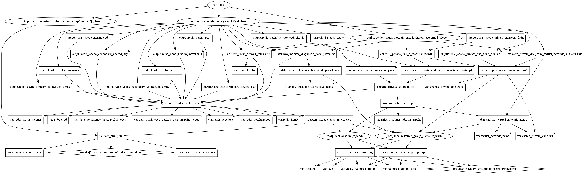

# Azure Cache for Redis Terraform module

Azure Cache for Redis provides an in-memory data store based on the Redis software. This terraform module helps to quickly create the open-source (OSS Redis) Azure Cache for Redis.

## Resources supported

* [Redis Cache Server](https://registry.terraform.io/providers/hashicorp/azurerm/latest/docs/resources/redis_cache)
* [Redis Cache Configuration](https://registry.terraform.io/providers/hashicorp/azurerm/latest/docs/resources/redis_cache#redis_configuration)
* [Redis Cache Firewall Rules](https://registry.terraform.io/providers/hashicorp/azurerm/latest/docs/resources/redis_firewall_rule)
* [Redis Cache Cluser](https://registry.terraform.io/providers/hashicorp/azurerm/latest/docs/resources/redis_cache#shard_count)
* [Redis Cache Virtual Network Support](https://registry.terraform.io/providers/hashicorp/azurerm/latest/docs/resources/redis_cache#subnet_id)
* [Redis Cache Data Persistence](https://registry.terraform.io/providers/hashicorp/azurerm/latest/docs/resources/redis_cache#rdb_backup_enabled)
* [Monitor Azure Cache for Redis](https://docs.microsoft.com/en-us/azure/azure-cache-for-redis/cache-how-to-monitor)
* [Private Endpoints](https://www.terraform.io/docs/providers/azurerm/r/private_endpoint.html)
* [Private DNS zone for `privatelink` A records](https://www.terraform.io/docs/providers/azurerm/r/private_dns_zone.html)

## Module Usage

```terraform
module "redis" {
  source  = "kumarvna/redis/azurerm"
  version = "1.0.0"

  # By default, this module will create a resource group
  # proivde a name to use an existing resource group and set the argument 
  # to `create_resource_group = false` if you want to existing resoruce group. 
  # If you use existing resrouce group location will be the same as existing RG.
  create_resource_group = false
  resource_group_name   = "rg-shared-westeurope-01"
  location              = "westeurope"

  # Configuration to provision a Standard Redis Cache
  # Specify `shard_count` to create on the Redis Cluster
  # Add patch_schedle to this object to enable redis patching schedule
  redis_server_settings = {
    demoredischache-shared = {
      sku_name            = "Premium"
      capacity            = 2
      shard_count         = 3
      zones               = ["1", "2", "3"]
      enable_non_ssl_port = true
    }
  }

  # MEMORY MANAGEMENT
  # Azure Cache for Redis instances are configured with the following default Redis configuration values:
  redis_configuration = {
    maxmemory_reserved = 2
    maxmemory_delta    = 2
    maxmemory_policy   = "allkeys-lru"
  }

  # Nodes are patched one at a time to prevent data loss. Basic caches will have data loss.
  # Clustered caches are patched one shard at a time. 
  # The Patch Window lasts for 5 hours from the `start_hour_utc`
  patch_schedule = {
    day_of_week    = "Saturday"
    start_hour_utc = 10
  }

  #Azure Cache for Redis firewall filter rules are used to provide specific source IP access. 
  # Azure Redis Cache access is determined based on start and end IP address range specified. 
  # As a rule, only specific IP addresses should be granted access, and all others denied.
  # "name" (ex. azure_to_azure or desktop_ip) may only contain alphanumeric characters and underscores
  firewall_rules = {
    access_to_azure = {
      start_ip = "1.2.3.4"
      end_ip   = "1.2.3.4"
    },
    desktop_ip = {
      start_ip = "49.204.228.223"
      end_ip   = "49.204.228.223"
    }
  }

  # Creating Private Endpoint requires, VNet name and address prefix to create a subnet
  # By default this will create a `privatelink.redis.cache.windows.net` DNS zone. 
  # To use existing private DNS zone specify `existing_private_dns_zone` with valid zone name
  # Private endpoints doesn't work If using `subnet_id` to create redis inside a specified VNet.
  enable_private_endpoint       = true
  virtual_network_name          = "vnet-shared-hub-westeurope-001"
  private_subnet_address_prefix = ["10.1.5.0/29"]
  #  existing_private_dns_zone     = "demo.example.com"

  # (Optional) To enable Azure Monitoring for Azure Cache for Redis
  # (Optional) Specify `storage_account_name` to save monitoring logs to storage. 
  log_analytics_workspace_name = "loganalytics-we-sharedtest2"

  # Tags for Azure Resources
  tags = {
    Terraform   = "true"
    Environment = "dev"
    Owner       = "test-user"
  }
}
```

## `redis_server_settings` - Azure Cache for Redis Server Settings

## `redis_configuration` - Azure Cache for Redis configuration

## Advanced Usage of the Module

### Memory Management

### Non-SSL port

### Firewall Rules

### Virtual network

### Data Persistence

### Patching Schedule

### Cluster Support

### Zones

### Private Link for Azure Cache for Redis

Azure Private Endpoint is a network interface that connects you privately and securely to a service powered by Azure Private Link. Private Endpoint uses a private IP address from your VNet, effectively bringing the service into your VNet.

With Private Link, Microsoft offering the ability to associate a logical server to a specific private IP address (also known as private endpoint) within the VNet. Clients can connect to the Private endpoint from the same VNet, peered VNet in same region, or via VNet-to-VNet connection across regions. Additionally, clients can connect from on-premises using ExpressRoute, private peering, or VPN tunneling.

By default, this feature not enabled on this module. To create private link with private endpoints set the variable `enable_private_endpoint` to `true` and provide `virtual_network_name`, `private_subnet_address_prefix` with a valid values. You can also use the existing private DNS zone to create DNS records. To use this feature, set the `existing_private_dns_zone` with a valid existing private DNS zone name.

For more details: [Azure Cache for Redis with Azure Private Link](https://docs.microsoft.com/en-us/azure/azure-cache-for-redis/cache-private-link)

> **[IMPORTANT]**
> There is a `publicNetworkAccess` flag which is `Disabled` by default. This flag is meant to allow you to optionally allow both public and private endpoint access to the cache if it is set to `Enabled`. If set to `Disabled`, it will only allow private endpoint access. You can set the value to `Disabled` or `Enabled`.
>
## Recommended naming and tagging conventions

Applying tags to your Azure resources, resource groups, and subscriptions to logically organize them into a taxonomy. Each tag consists of a name and a value pair. For example, you can apply the name `Environment` and the value `Production` to all the resources in production.
For recommendations on how to implement a tagging strategy, see Resource naming and tagging decision guide.

> [IMPORTANT]
> Tag names are case-insensitive for operations. A tag with a tag name, regardless of the casing, is updated or retrieved. However, the resource provider might keep the casing you provide for the tag name. You'll see that casing in cost reports. **Tag values are case-sensitive.**
>

An effective naming convention assembles resource names by using important resource information as parts of a resource's name. For example, using these [recommended naming conventions](https://docs.microsoft.com/en-us/azure/cloud-adoption-framework/ready/azure-best-practices/naming-and-tagging#example-names), a public IP resource for a production SharePoint workload is named like this: `pip-sharepoint-prod-westus-001`.

## Requirements

| Name | Version |
|------|---------|
| terraform | >= 0.13 |
| azurerm | >= 2.59.0 |

## Providers

| Name | Version |
|------|---------|
| azurerm | >= 2.59.0 |
| random |>= 3.1.0 |

## Inputs

| Name | Description | Type | Default |
|--|--|--|--|
`create_resource_group` | Whether to create resource group and use it for all networking resources | string | `"false"`
`resource_group_name` | The name of the resource group in which resources are created | string | `""`
`location` | The location of the resource group in which resources are created | string | `""`
`log_analytics_workspace_name`|The name of log analytics workspace name|string|`null`
`redis_instance_name`|The name of the Redis instance|string|`""`
`redis_family`|The SKU family/pricing group to use. Valid values are `C` (for `Basic/Standard` SKU family) and `P` (for `Premium`)|map(any)|`{}`
`redis_server_settings`|optional redis server setttings for both Premium and Standard/Basic SKU|map(object({}))|`{}`
`patch_schedule`|The window for redis maintenance. The Patch Window lasts for 5 hours from the `start_hour_utc`|object({})|`null`
`subnet_id`|The ID of the Subnet within which the Redis Cache should be deployed. Only available when using the Premium SKU|string|`null`
`redis_configuration`|Memory and other optional configuration for the Redis instance|object({})|`{}`
`storage_account_name`|The name of the storage account name|string|`null`
`enable_data_persistence`|`Enable` or `disbale` Redis Database Backup. Only supported on Premium SKU's|string|`false`
`data_persistence_backup_frequency`|The Backup Frequency in Minutes. Only supported on Premium SKU's. Possible values are: `15`, `30`, `60`, `360`, `720` and `1440`|number|`60`
`data_persistence_backup_max_snapshot_count`|The maximum number of snapshots to create as a backup. Only supported for Premium SKU's|number|`1`
`firewall_rules`|Range of IP addresses to allow firewall connections. Azure Cache for Redis firewall filter rules are used to provide specific source IP access. Azure Redis Cache access is determined based on start and end IP address range specified. As a rule, only specific IP addresses should be granted access, and all others denied.|map(object({}))|`null`
`enable_private_endpoint`|Azure Private Endpoint is a network interface that connects you privately and securely to a service powered by Azure Private Link|string|`"false"`
`virtual_network_name` | The name of the virtual network|string|`""`
`private_subnet_address_prefix`|A list of subnets address prefixes inside virtual network| list |`[]`
`existing_private_dns_zone`|Name of the existing private DNS zone|string|`null`
`Tags` | A map of tags to add to all resources | map | `{}`

# Outputs

| Name | Description |
|--|--|
`redis_cache_instance_id`|The Route ID of Redis Cache Instance
`redis_cache_hostname`|The Hostname of the Redis Instance
`redis_cache_ssl_port`|The SSL Port of the Redis Instance
`redis_cache_port`|The non-SSL Port of the Redis Instance
`redis_cache_primary_access_key`|The Primary Access Key for the Redis Instance
`redis_cache_secondary_access_key`|The Secondary Access Key for the Redis Instance
`redis_cache_primary_connection_string`|The primary connection string of the Redis Instance
`redis_cache_secondary_connection_string`|The secondary connection string of the Redis Instance
`redis_configuration_maxclients`|Returns the max number of connected clients at the same time
`redis_cache_private_endpoint`|id of the Redis Cache server Private Endpoint
`redis_cache_private_dns_zone_domain`|DNS zone name of Redis Cache server Private endpoints dns name records
`redis_cache_private_endpoint_ip`|Redis Cache server private endpoint IPv4 Addresses
`redis_cache_private_endpoint_fqdn`|Redis Cache server private endpoint FQDN Addresses

## Resource Graph



## Authors

Originally created by [Kumaraswamy Vithanala](mailto:kumarvna@gmail.com)

## Other resources

* [Azure Cache for Redis](https://docs.microsoft.com/en-us/azure/azure-cache-for-redis/)
* [Terraform AzureRM Provider Documentation](https://www.terraform.io/docs/providers/azurerm/index.html)
